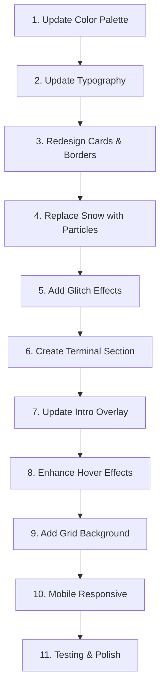

# 🚀 Kế Hoạch Nâng Cấp Website Profile - Cyberpunk/Futuristic Tech Style

## 📊 Phân Tích Website Hiện Tại

### ✅ Điểm Mạnh Cần Giữ Lại
- **Structure tốt**: Layout 2 cột responsive, phân chia nội dung hợp lý
- **Hero section** với avatar và tags rõ ràng
- **Social links** đầy đủ (Discord, GitHub, Steam)
- **Stack & interests** hiển thị công nghệ sử dụng
- **Intro overlay** tạo ấn tượng ban đầu
- **Custom cursor** và animations mượt mà

### ⚠️ Điểm Cần Cải Thiện
- **Color palette** hiện tại (teal/cyan soft) chưa đủ cyberpunk
- **Hiệu ứng tuyết** không phù hợp với tech vibe
- **Typography** thiếu monospace fonts cho code aesthetic
- **Borders và glow effects** chưa có neon cyberpunk
- **Hero heading** cần glitch effect ấn tượng hơn
- **Background** aurora gradient chưa đủ futuristic

---

## 🎨 Design System Mới - Cyberpunk Minimalist

### Color Palette

```css
/* Primary Cyberpunk Colors */
--cyber-black: #0a0a0f;           /* Deep space black */
--cyber-dark: #0f0f1e;            /* Card backgrounds */
--cyber-cyan: #00f0ff;            /* Primary neon cyan */
--cyber-magenta: #ff006e;         /* Accent magenta/pink */
--cyber-purple: #7b2cbf;          /* Secondary purple */
--cyber-blue: #00b4d8;            /* Info blue */

/* Text Colors */
--text-primary: #e8f5ff;          /* Bright white-blue */
--text-secondary: #a8b2d1;        /* Muted blue-gray */
--text-muted: #6b7a99;            /* Subtle gray */

/* Neon Glows */
--glow-cyan: 0 0 10px rgba(0, 240, 255, 0.5),
             0 0 20px rgba(0, 240, 255, 0.3),
             0 0 30px rgba(0, 240, 255, 0.1);
--glow-magenta: 0 0 10px rgba(255, 0, 110, 0.5),
                0 0 20px rgba(255, 0, 110, 0.3);
--glow-purple: 0 0 10px rgba(123, 44, 191, 0.4);
```

### Typography Stack

```css
/* Monospace for code vibe */
--font-mono: 'JetBrains Mono', 'Fira Code', 'Courier New', monospace;

/* Modern sans for readability */
--font-sans: 'Inter', 'Space Grotesk', system-ui, sans-serif;

/* Terminal font */
--font-terminal: 'IBM Plex Mono', monospace;
```

---

## 🎯 Chi Tiết Các Thay Đổi

### 1. Background & Ambient Effects

#### Thay đổi:
- **Loại bỏ**: Aurora gradient động (quá soft)
- **Thêm mới**:
  - **Animated grid pattern** overlay (cyberpunk grid lines)
  - **Scan line animation** subtle (như CRT monitor)
  - **Gradient mesh** với cyan/purple/magenta

#### Technical Implementation:
```css
/* Animated cyberpunk grid */
background-image: 
  linear-gradient(rgba(0, 240, 255, 0.1) 1px, transparent 1px),
  linear-gradient(90deg, rgba(0, 240, 255, 0.1) 1px, transparent 1px);
background-size: 50px 50px;
animation: gridMove 20s linear infinite;

/* Scan lines */
body::after {
  background: repeating-linear-gradient(
    0deg,
    rgba(0, 240, 255, 0.03),
    rgba(0, 240, 255, 0.03) 1px,
    transparent 1px,
    transparent 2px
  );
  animation: scanline 8s linear infinite;
}
```

---

### 2. Particles System - Matrix Style

#### Thay đổi:
- **Loại bỏ**: Snowflakes effect
- **Thêm mới**: Matrix rain hoặc Geometric particles

#### Option A: Matrix Rain (Minimalist)
- Chữ số nhị phân (0, 1) rơi từ trên xuống
- Màu cyan với fade effect
- Tốc độ vừa phải, không quá rối
- Opacity thấp (0.3-0.5) để không át nội dung

#### Option B: Geometric Particles (Recommended)
- Hình tam giác, vuông, hexagon nhỏ
- Di chuyển chậm theo đường random
- Màu cyan/purple với glow nhẹ
- Kết nối các particles gần nhau bằng lines

#### Technical Implementation:
```javascript
// Geometric particles với Three.js hoặc Canvas
particles.push({
  x, y, z,
  shape: 'triangle', // hoặc 'square', 'hexagon'
  color: 'cyan',
  velocity: {x: random, y: random},
  glow: 0.4
});
```

---

### 3. Header & Navigation

#### Thay đổi:

**Logo "VIBE CODER"**:
- Font: Monospace bold
- Text effect: Subtle glitch on hover
- Color: Cyan với text-shadow glow

**Status pill "Christmas mode"**:
- Đổi thành: `"SYSTEM ONLINE · <TIMESTAMP>"`
- Monospace font
- Neon border với animated pulse
- Real-time clock JS

```html
<!-- Before -->
<div class="pill">
  <span class="pill-dot"></span>
  <span>Christmas mode · Online ✦</span>
</div>

<!-- After -->
<div class="pill cyber-pill">
  <span class="terminal-icon">▸</span>
  <span id="system-status">SYSTEM ONLINE</span>
  <span class="separator">·</span>
  <span id="timestamp">18:30:45</span>
</div>
```

---

### 4. Hero Section - "TIN VO"

#### Thay đổi:

**Avatar**:
- Giữ nguyên ảnh
- Thêm **hexagon clip-path** thay vì circle
- Border: Neon cyan với animated rotation
- Glow effect khi hover

**Hero Heading**:
- Font size lớn hơn (42-48px)
- **Glitch effect animation** liên tục nhẹ
- Text gradient: Cyan → Purple
- Text shadow: Neon glow

**Subtitle "Student • Developer..."**:
- Giữ decode effect hiện tại (rất hay!)
- Font: Monospace
- Color: Cyan với typing cursor animation

**Tags**:
- Border: Neon glow
- Background: Darker với transparency
- Hover: Màu đổi cyan → magenta
- Transform: Scale + glow tăng

#### Technical Implementation:
```css
.hero-heading {
  font-family: var(--font-mono);
  font-size: 48px;
  font-weight: 900;
  background: linear-gradient(135deg, 
    var(--cyber-cyan), 
    var(--cyber-purple));
  -webkit-background-clip: text;
  -webkit-text-fill-color: transparent;
  animation: glitchText 3s infinite;
  text-shadow: var(--glow-cyan);
}

@keyframes glitchText {
  0%, 100% { transform: translate(0); }
  20% { transform: translate(-2px, 2px); }
  40% { transform: translate(2px, -2px); }
  60% { transform: translate(-2px, -2px); }
  80% { transform: translate(2px, 2px); }
}
```

---

### 5. Cards Redesign - Neon Glassmorphism

#### Thay đổi cho tất cả cards:

**Background**:
```css
background: rgba(15, 15, 30, 0.7);
backdrop-filter: blur(12px) saturate(150%);
border: 1px solid rgba(0, 240, 255, 0.3);
box-shadow: 
  0 8px 32px rgba(0, 0, 0, 0.6),
  inset 0 1px 0 rgba(0, 240, 255, 0.1);
```

**Border Animation**:
- Animated gradient border khi hover
- Neon glow tăng dần
- Transform: slight lift + tilt 3D

**Hover Light Effect**:
- Giữ nguyên mouse tracking light
- Đổi màu: Cyan → Magenta gradient
- Intensity cao hơn

---

### 6. Social Buttons - Neon Interactive

#### Redesign:

**Layout mới**:
```
┌─────────────────────────────┐
│ [💬] DISCORD                │
│     @Lu2026.         [→]    │
└─────────────────────────────┘
```

**Styles**:
- Neon border color theo từng platform
- Icon lớn hơn với glow
- Hover: Border glow + slide right animation
- Arrow icon xuất hiện khi hover

**Colors**:
- Discord: `#5865f2` (blue-purple)
- GitHub: `#ffffff` (white)
- Steam: `#00adee` (cyan-blue)

---

### 7. Terminal Section - NEW!

#### Thêm section mới giữa About và Stack:

```
╔══════════════════════════════════╗
║ $ whoami                         ║
║ > tin_vo                         ║
║                                  ║
║ $ cat skills.txt                 ║
║ > Flutter, Laravel, Networking   ║
║ > Docker, Git, VS Code           ║
║                                  ║
║ $ echo $STATUS                   ║
║ > Learning & Building...█        ║
╚══════════════════════════════════╝
```

**Features**:
- Monospace font (IBM Plex Mono)
- Typing animation với cursor blink
- Syntax highlighting colors
- Dark terminal background
- Green text với glow (classic terminal)

---

### 8. Stack & Interests Cards

#### Redesign chips:

**Before**: Rounded pills soft colors
**After**: 
- **Hexagon shapes** hoặc **sharp corners**
- Neon borders (cyan/magenta/purple)
- Icon cho mỗi tech (HTML, CSS, Flutter...)
- Hover: Glow + rotate slightly
- **Animated gradient** background subtle

```html
<div class="tech-chip">
  <span class="tech-icon">⚡</span>
  <span class="tech-label">Flutter</span>
</div>
```

#### Gear Grid:
- Border style: Neon cyan
- Label: Monospace uppercase
- Hover: Entire card glows

---

### 9. Animations & Interactions

#### Micro-interactions mới:

1. **Button Click Ripple**: Wave effect khi click
2. **Card Tilt**: 3D perspective on hover (giữ nguyên)
3. **Glitch Transition**: Khi hover vào heading
4. **Pulse Animation**: Cho status indicators
5. **Gradient Shift**: Background gradient di chuyển chậm

#### Loading Animations:
- Cards appear với **slide + fade từ dưới lên**
- Stagger delay giữa các cards (đã có)
- Intro overlay: **Matrix text rain** effect before enter

---

### 10. Intro Overlay Upgrade

#### Thay đổi:

**Hiện tại**: "CLICK TO ENTER ▲" text đơn giản

**Mới**:
```
╔═══════════════════════════════╗
║                               ║
║    > INITIALIZING SYSTEM...   ║
║    > LOADING PROFILE...       ║
║    > READY █                  ║
║                               ║
║    [ PRESS ANY KEY ]          ║
║                               ║
╚═══════════════════════════════╝
```

- Typing effect từng dòng
- Terminal aesthetic
- Blinking cursor
- Matrix rain background nhẹ
- Sound effect (optional) khi click

---

## 📐 Responsive Design

### Mobile Optimizations:

1. **Grid → Stack**: 2 columns collapse to 1 column
2. **Reduce particles**: 50% particles trên mobile
3. **Simplify animations**: Tắt 3D tilt, chỉ giữ fade/slide
4. **Font sizes**: Scale down 80%
5. **Touch-friendly**: Button sizes tối thiểu 44x44px

---

## 🎭 Component Breakdown

### Components cần viết/chỉnh:

| Component | File | Action |
|-----------|------|--------|
| Matrix Particles | `script.js` | Replace snow function |
| Glitch Effect | `styles.css` | New keyframe animation |
| Terminal Section | `index.html` | New HTML section |
| Neon Borders | `styles.css` | Update card styles |
| Cyberpunk Grid | `styles.css` | New background pattern |
| System Status | `script.js` | Real-time clock |
| Intro Terminal | `script.js` | Typing animation |
| Color Variables | `styles.css` | Update CSS custom properties |

---

## 🎬 Implementation Order



---

## ✅ Success Criteria

Website đạt chuẩn khi:

- ✅ Color palette **cyberpunk** rõ ràng (cyan/magenta/purple)
- ✅ **Monospace fonts** cho code vibe
- ✅ **Matrix particles** hoặc geometric particles mượt mà
- ✅ **Glitch effects** trên hero heading
- ✅ **Neon borders** với glow animations
- ✅ **Terminal section** hoạt động tốt
- ✅ Hover effects **smooth** và ấn tượng
- ✅ Mobile responsive **không bị vỡ layout**
- ✅ Performance tốt (60fps)
- ✅ Loading time < 3 giây

---

## 🔧 Technical Stack

- **HTML5**: Semantic markup
- **CSS3**: Custom properties, animations, grid, flexbox
- **JavaScript ES6+**: Canvas API, animations, typing effects
- **Fonts**: Google Fonts (JetBrains Mono, Inter)
- **Optional**: Three.js cho particles (nếu cần advanced 3D)

---

## 📝 Notes & Considerations

### Performance:
- Particles: Tối đa 100 particles để đảm bảo 60fps
- Animations: Use `transform` và `opacity` (GPU-accelerated)
- Images: Optimize avatar.jpg và bg.jpg (WebP format)

### Browser Support:
- Chrome/Edge: Full support
- Firefox: Full support  
- Safari: Test backdrop-filter (có fallback)
- Mobile: iOS Safari, Chrome Android

### Accessibility:
- Giữ contrast ratio > 4.5:1
- Keyboard navigation cho tất cả buttons
- Alt text cho images
- Prefers-reduced-motion: Tắt animations nếu user request

---

## 🚀 Ready to Implement?

Kế hoạch này đã chi tiết từng bước để nâng cấp website của bạn lên phong cách **Cyberpunk/Futuristic Tech** với **Minimalist touch**. 

**Câu hỏi cho bạn:**

1. Bạn có muốn điều chỉnh gì trong kế hoạch này không?
2. Bạn có muốn tôi giải thích chi tiết hơn phần nào không?
3. Bạn có muốn tôi tạo mockup code mẫu cho một component cụ thể không?
4. Bạn đã sẵn sàng để chuyển sang **Code mode** để implement không?
